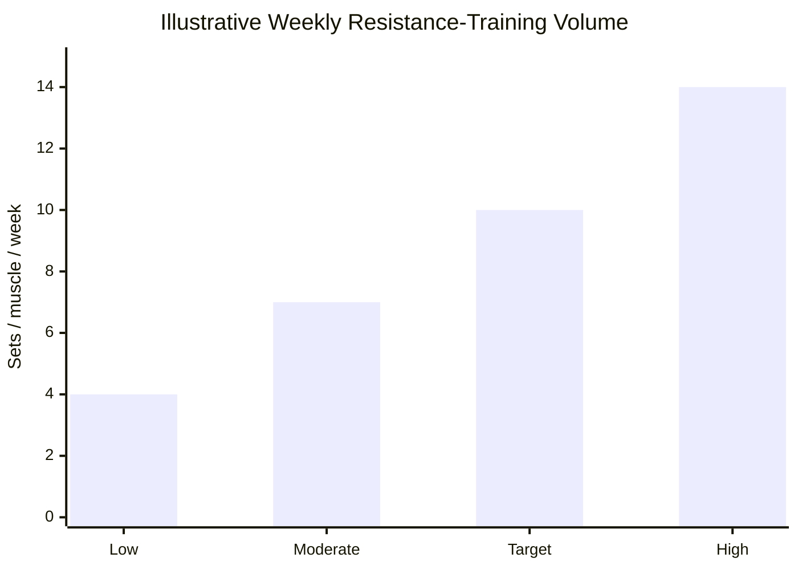
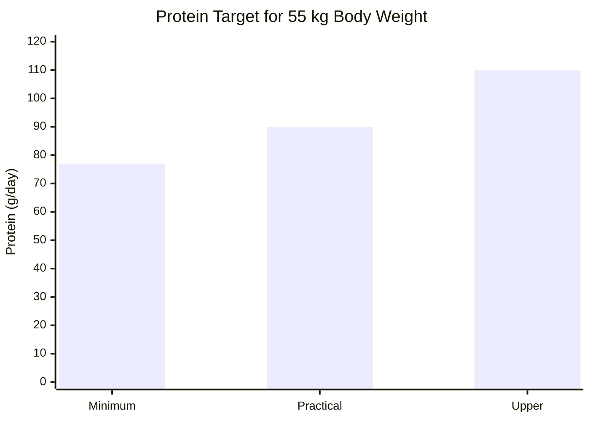
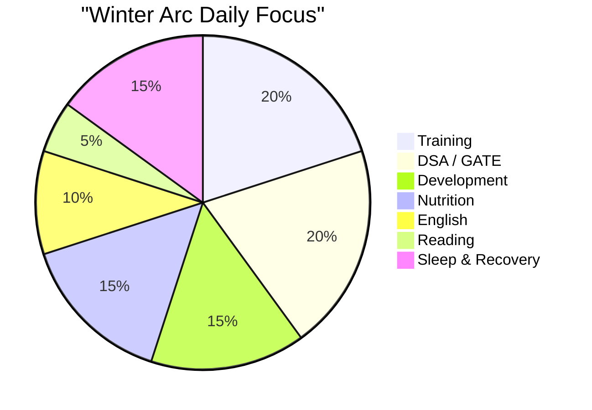
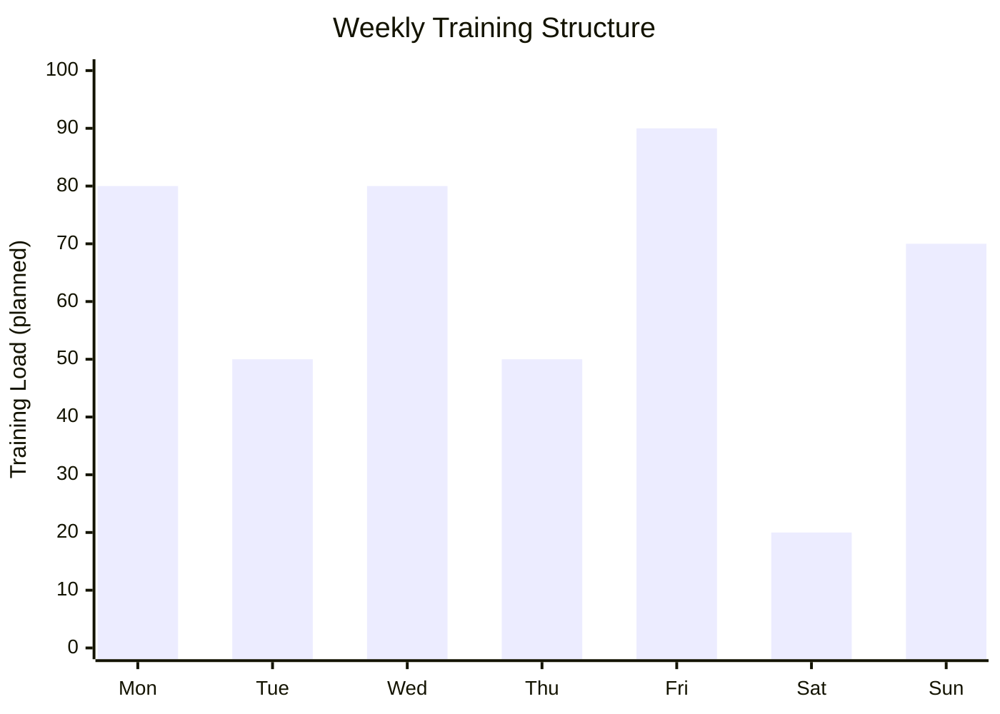
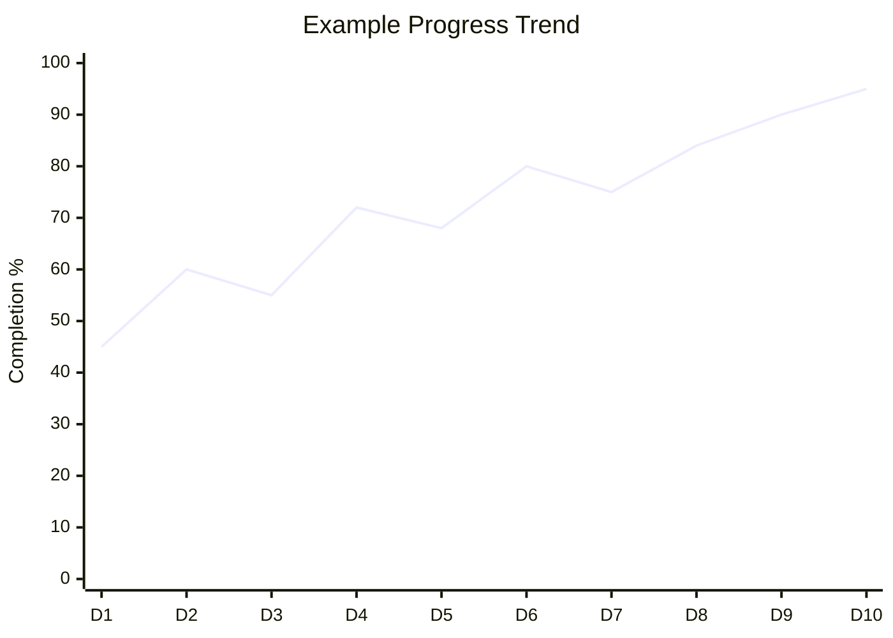
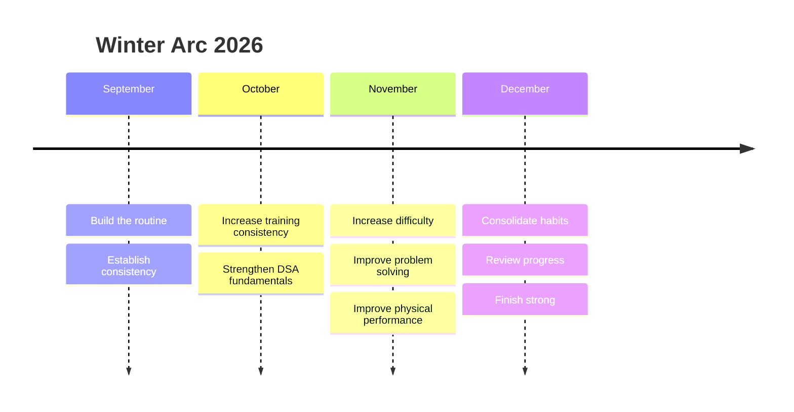

# ❄️ WINTER ARC 2026

<div align="center">

## `DISCIPLINE → CONSISTENCY → PROGRESS`

A modern personal **fitness + productivity + self-improvement dashboard** built with pure HTML, CSS and JavaScript.

**01 September 2026 → 31 December 2026**

<br>


</div>

---

# 🧊 What is Winter Arc?

Winter Arc is a personal challenge built around one simple idea:

> **Become better through consistent daily actions instead of waiting for motivation.**

The system combines:

* 🧠 Mental growth
* 💻 Career development
* 🏋️ Strength training
* 🏃 Running
* 🥗 Nutrition
* 😴 Sleep
* 📚 Learning
* 🗣️ English communication
* 📱 Digital discipline

The goal is not to have a perfect day.

The goal is to **reduce the number of zero days**.

---

# 🎯 The 4-Month Mission

```text
01 SEP 2026
     │
     ▼
┌───────────────┐
│   BUILD       │
│   ROUTINE     │
└───────┬───────┘
        │
        ▼
┌───────────────┐
│   BUILD       │
│   STRENGTH    │
└───────┬───────┘
        │
        ▼
┌───────────────┐
│   BUILD       │
│   KNOWLEDGE   │
└───────┬───────┘
        │
        ▼
┌───────────────┐
│   BUILD       │
│   CONSISTENCY │
└───────┬───────┘
        │
        ▼
31 DEC 2026
```

---

# 📊 Why These Targets?

The dashboard is not based entirely on arbitrary numbers.

It uses general evidence-based guidelines and then adapts them into a practical personal routine.

## 🏃 Aerobic Activity

Current CDC/HHS guidance recommends adults accumulate:

* **150–300 minutes/week** of moderate aerobic activity, or
* **75–150 minutes/week** of vigorous aerobic activity,
* plus muscle-strengthening activity on **2+ days/week**.

The Winter Arc therefore uses:

```text
Tuesday     🏃 Conventional Run
Thursday    🏃 Conventional Run
Sunday      ⚡ Sprint
```

The exact running duration/intensity should be adjusted according to fitness level and recovery.

---

# 🏋️ Resistance Training

The 2026 ACSM resistance-training update reviewed evidence from **137 systematic reviews and more than 30,000 participants**.

Its main message is:

> **Consistency beats complexity.**

For muscle growth, ACSM highlights roughly **10 weekly sets per muscle group** as a useful target, while emphasizing that the best program is one a person can consistently follow.

### Winter Arc split

```text
MONDAY       🔴 PUSH
             Chest
             Shoulders
             Triceps

WEDNESDAY    🔵 PULL
             Back
             Biceps
             Rear delts

FRIDAY       🟢 LEGS
             Quads
             Hamstrings
             Glutes
             Calves

SUNDAY       ⚡ SPRINT
             Speed
             Power
             Conditioning
```

### Why sprint is Sunday?

The sprint session is separated from the Friday leg workout instead of placing sprinting immediately after leg day.

This gives the lower body additional recovery time.

---

# 📈 Training Volume Concept

A useful way to think about weekly muscle-building volume:



**Important:** This is an explanatory chart, not a claim that exactly 10 sets is optimal for every individual. ACSM's 2026 guidance gives ~10 sets/muscle/week as a practical hypertrophy-oriented target, while emphasizing individualization.

---

# 🥗 Protein Target

For people who exercise, a commonly cited sports-nutrition range is approximately:

**1.4–2.0 g protein/kg/day**.

For a **55 kg body weight**:

```text
55 × 1.4 = 77 g/day

55 × 2.0 = 110 g/day
```

### 🎯 Practical target

```text
        77g ├───────────────┤ 110g
            ↑               ↑
          Lower           Upper
          target           target
```

A practical starting target could therefore be around:

## `80–100 g protein/day`

from normal vegetarian/home foods such as:

* 🥛 Milk
* 🥣 Curd
* 🧀 Paneer
* 🌱 Soy / tofu
* 🫘 Dal
* 🫘 Rajma
* 🫘 Chole
* 🥜 Peanuts
* 🌾 Roasted chana

Actual calorie and protein needs vary by body size, activity, goals and overall diet.

---

# 📊 Protein Target Chart



### Why protein matters

Resistance exercise stimulates muscle protein synthesis, and adequate dietary protein supports the body's ability to build and maintain muscle tissue. Protein intake around training can work synergistically with resistance exercise.

---

# 😴 Sleep & Recovery

Sleep is not a reward after productivity.

It is part of the training system.

CDC guidance says adults aged 18–60 generally need **7 or more hours of sleep per night**.

### Winter Arc target

```text
10:00 PM
   │
   │  😴 SLEEP
   │
   ▼
05:30–06:00 AM
```

That gives approximately:

```text
7.5 – 8 hours
```

of scheduled sleep opportunity.

### Why it matters

Sleep supports:

* Recovery
* Cognitive performance
* Mood
* Daily energy
* Physical health

CDC also recommends keeping a consistent sleep schedule.

---

# 📊 The Daily System

The dashboard divides the day into several important categories.



> These percentages represent the **designed focus of the system**, not measured hours or scientific requirements.

---

# 🧠 Problem-Solving System

Winter Arc is not only about fitness.

A major goal is improving the ability to **solve difficult problems consistently**.

### DSA workflow

```text
UNDERSTAND
     ↓
IDENTIFY PATTERN
     ↓
BRUTE FORCE
     ↓
ANALYZE COMPLEXITY
     ↓
OPTIMIZE
     ↓
CODE
     ↓
TEST
     ↓
REVIEW
```

Instead of immediately searching for a solution:

### Step 1 — Understand

Ask:

* What exactly is given?
* What needs to be returned?
* What are the constraints?
* What edge cases exist?

### Step 2 — Brute Force

First find a solution that works.

Don't optimize prematurely.

### Step 3 — Find the Pattern

Look for:

```text
Two Pointers
Sliding Window
HashMap
Binary Search
Stack
Queue
Heap
Recursion
Backtracking
Greedy
Dynamic Programming
Graphs
Trees
```

### Step 4 — Complexity

Always ask:

```text
Time Complexity?
Space Complexity?
Can it be improved?
```

### Step 5 — Re-solve

After learning a solution:

```text
Day 1       Solve
Day 3       Re-solve
Day 7       Re-solve
Day 14      Re-solve
```

This turns knowledge into problem-solving ability.

---

# 📚 GATE + DSA Strategy

The system can combine GATE preparation and DSA without treating them as completely separate goals.

```text
                    STUDY
                      │
          ┌───────────┴───────────┐
          │                       │
         GATE                    DSA
          │                       │
    ┌─────┴─────┐           ┌─────┴─────┐
    │ Concepts  │           │ Patterns  │
    │ PYQs      │           │ Problems  │
    │ Revision  │           │ Review    │
    └───────────┘           └───────────┘
```

### Recommended daily loop

```text
LEARN
 ↓
PRACTICE
 ↓
MAKE MISTAKES
 ↓
ANALYZE
 ↓
REVISE
 ↓
REPEAT
```

---

# 🗣️ English Fluency

English practice is treated as a **daily skill**, not something to study once a week.

### Daily method

```text
10 min  → Speak
10 min  → Listen
10 min  → Read
10 min  → Think / describe in English
```

### Problem-solving approach

Don't try to memorize thousands of words.

Instead:

```text
INPUT
 ↓
UNDERSTAND
 ↓
SPEAK
 ↓
MAKE MISTAKES
 ↓
CORRECT
 ↓
REPEAT
```

The objective is **communication**, not perfect grammar.

---

# 📱 Digital Discipline

One of the easiest ways to destroy a routine is uncontrolled screen time.

The tracker therefore includes:

```text
Social Media ≤ 45 min
```

The goal isn't necessarily zero phone usage.

The goal is:

> **Use technology intentionally instead of automatically.**

---

# 📅 Weekly Training Chart



```text
MON    🔴 PUSH
TUE    🏃 RUN
WED    🔵 PULL
THU    🏃 RUN
FRI    🟢 LEGS
SAT    🧘 RECOVERY
SUN    ⚡ SPRINT
```

The load values above are **planning values**, not physiological measurements.

---

# 🔥 The "No Zero Day" Rule

A bad day doesn't need to become a zero day.

For example:

### Full day

```text
DSA             ✅
Workout         ✅
Nutrition       ✅
English         ✅
Reading         ✅
Sleep           ✅
```

### Difficult day

```text
DSA             ✅  20 min
Workout         ❌
English         ✅  10 min
Reading         ❌
Nutrition       ✅
Sleep           ✅
```

That's still progress.

The objective is:

> **Never let one bad day become a bad week.**

---

# 📊 Progress Calculation

Every task is converted into a simple completion score.

```text
Completed Tasks
─────────────── × 100
 Total Tasks
```

Example:

```text
10 completed
──────────── × 100
12 total

= 83%
```

The dashboard then calculates:

### Daily

```text
Today's completed tasks
```

### Weekly

```text
Average daily completion
```

### Overall

```text
Average progress
through the Winter Arc
```

### Streak

```text
Consecutive 100% days
```

---

# 📈 Progress History

The dashboard stores daily completion percentages.



The important thing isn't whether the graph is perfectly upward.

Real progress looks more like:

```text
100 │              ╭─╮
 80 │       ╭──╮   │ ╰──╮
 60 │  ╭──╮  │  ╰──╯    ╰╮
 40 │──╯  ╰──╯            ╰──
 20 │
  0 └──────────────────────────
```

The goal is a **positive long-term trend**.

---

# 💾 How Data Storage Works

The application uses browser `localStorage`.

```text
                 WINTER ARC
                     │
                     ▼
                JavaScript
                     │
                     ▼
                localStorage
                     │
        ┌────────────┼────────────┐
        ▼            ▼            ▼
     Sep 1        Sep 2        Sep 3
      80%          90%           70%
        │            │            │
        └────────────┼────────────┘
                     ▼
              Progress Chart
```

No backend is required.

---

# 🔐 Privacy

Your task progress is stored locally in the browser.

The application does not require:

* ❌ Login
* ❌ Database
* ❌ Backend
* ❌ API
* ❌ Account

Your progress stays in your browser unless you export it.

---

# 💾 Backup System

Use:

```text
💾 EXPORT
```

to download:

```text
winter-arc-progress-backup.json
```

Later:

```text
↥ IMPORT
     ↓
backup.json
     ↓
restore progress
```

This allows you to keep a backup of your journey.

---

# 🛠️ Tech Stack

```text
Frontend
├── HTML5
├── CSS3
└── Vanilla JavaScript

UI
├── DM Sans
├── Space Grotesk
├── CSS Glassmorphism
└── Responsive Design

Data
└── LocalStorage

Charts
└── HTML Canvas

Deployment
└── Vercel
```

---

# 📁 Project Structure

```text
winter-arc/
│
├── index.html
│
└── README.md
```

The current version intentionally keeps the project extremely lightweight.

---

# 🚀 Run Locally

Clone the repository:

```bash
git clone https://github.com/YOUR_USERNAME/winter-arc.git
```

Enter the directory:

```bash
cd winter-arc
```

Open:

```text
index.html
```

No dependencies are required.

No build process is required.

---

# ☁️ Deployment

The project is a static website and can be deployed directly through Vercel.

```text
GitHub
   │
   ▼
Vercel
   │
   ▼
index.html
   │
   ▼
🌐 Winter Arc Dashboard
```

---

# 🗓️ Winter Arc Timeline



---

# 🧠 Evidence-Based Principles

The system follows several broad principles supported by current exercise and sleep guidance:

### 1. Consistency > Complexity

ACSM's 2026 resistance-training update emphasizes that consistent participation matters more than building an unnecessarily complicated program.

### 2. Move More

Adults benefit from regular aerobic activity and should reduce sedentary time.

### 3. Strength Matters

Adults should perform muscle-strengthening activity involving major muscle groups on at least two days each week.

### 4. Recovery Matters

Adults generally need at least seven hours of sleep per night.

### 5. Nutrition Supports Training

For exercising individuals, approximately 1.4–2.0 g/kg/day protein is a commonly supported range for maintaining/building muscle.

---

# ⚠️ Important

This project is a **personal tracking system**, not a medical or individualized training prescription.

Training volume, running intensity, calories, protein and recovery should be adjusted according to:

* Age
* Training experience
* Fitness level
* Goals
* Injury history
* Recovery
* Medical conditions

If exercise causes significant pain, dizziness, chest symptoms or other concerning symptoms, stop and seek appropriate medical advice.

---

# 🔮 Future Improvements

Possible future versions:

```text
V1
├── Daily checklist
├── LocalStorage
├── Progress chart
└── Export / Import

V2
├── User authentication
├── Cloud database
├── Cross-device sync
└── Online dashboard

V3
├── Habit heatmap
├── XP system
├── Achievement badges
├── Personal records
├── Workout logging
└── Advanced analytics

V4
├── AI coach
├── Automatic weekly review
├── Training recommendations
├── Nutrition tracking
└── Personal progress insights
```

---

# ⭐ Philosophy

```text
                    DON'T
                     ↓
              WAIT FOR MOTIVATION
                     ↓
                 BUILD SYSTEMS
                     ↓
                SHOW UP DAILY
                     ↓
               TRACK THE WORK
                     ↓
                LEARN FROM IT
                     ↓
                 IMPROVE
                     ↓
                  REPEAT
```

> **You don't need to win every day.**
>
> **You need to keep showing up.**

---

<div align="center">

# ❄️ WINTER ARC 2026

### `01 SEP → 31 DEC`

**BUILD YOUR BODY.**

**BUILD YOUR MIND.**

**BUILD YOUR FUTURE.**

### `NO ZERO DAYS.`

<br>

⭐ If this project helps you stay consistent, give the repository a star.

</div>
